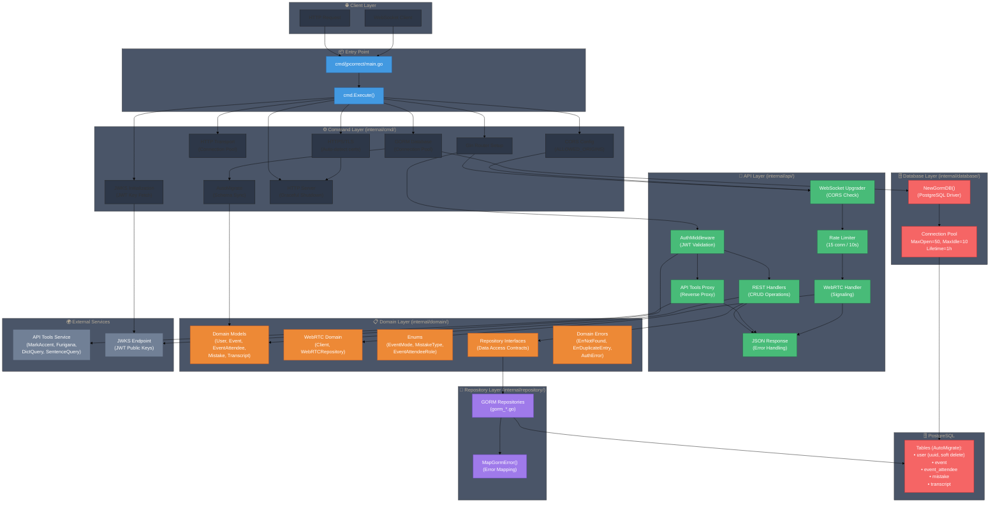
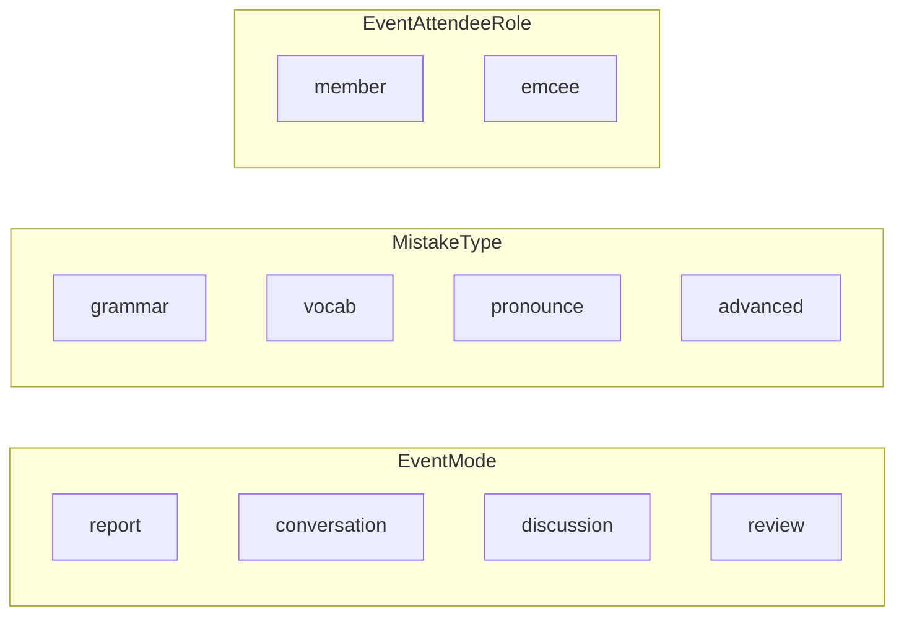
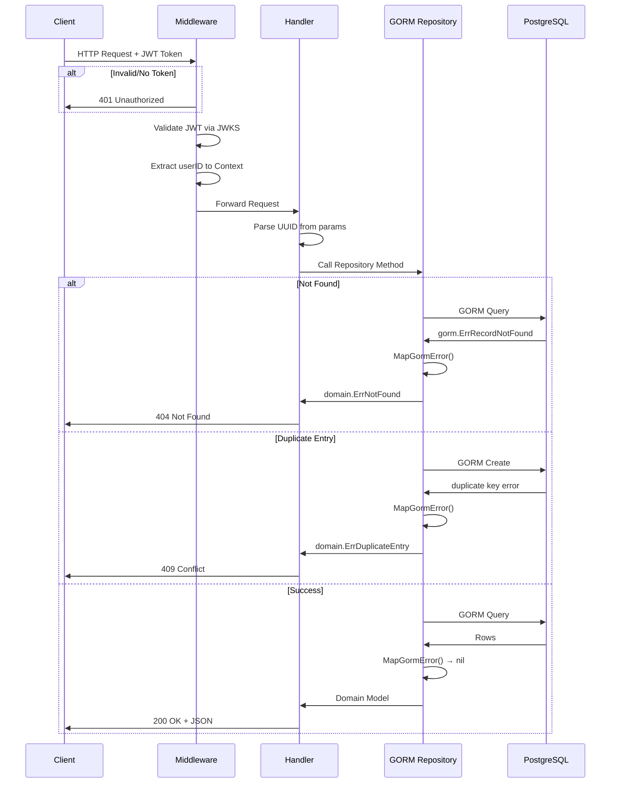
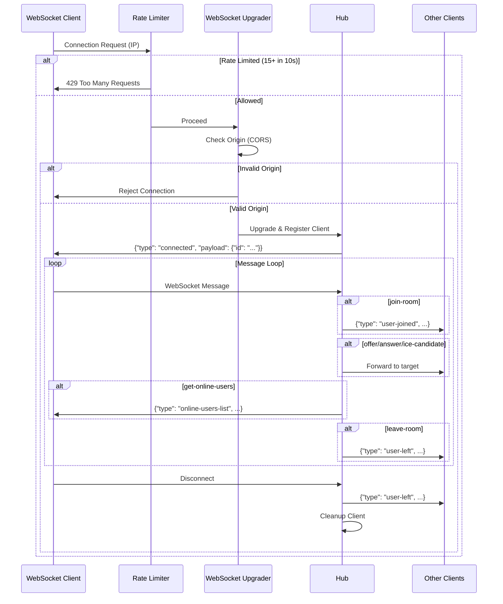
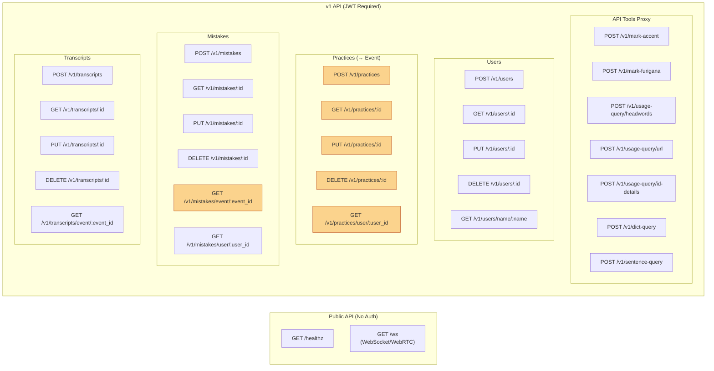

# jpcorrect-backend Architecture

## Overview

jpcorrect-backend is a Go-based REST API for a Japanese language correction platform. This architecture combines **GORM-based persistence** (migrated from pgx/sqlc) with **WebRTC real-time communication** features.

> **Refactor Commit**: `ce929a6` (2026-01-28)  
> **WebRTC Integration**: `41f63b5` (2026-02-22)

## Architecture Diagram



## Data Model

> 📋 **完整的 schema 詳細、ERD 圖與 Developer Notes 請參閱** `docs/database-design.md`

**核心領域模型**：
- `User` - 使用者（UUID PK, soft delete）
- `Event` - 日文練習活動（取代舊的 Practice）
- `EventAttendee` - 活動參與者（多對多）
- `Mistake` - 錯誤紀錄
- `Transcript` - 逐字稿
- `Guild` - 公會
- `GuildAttendee` - 公會成員（多對多）

**Enums**：
- `EventMode`: report, conversation, discussion, review
- `MistakeType`: grammar, vocab, pronounce, advanced
- `EventAttendeeRole`: member, emcee
- `GuildAttendeeRole`: member, master
- `UserRole`: user, admin, staff
- `UserStatus`: active, banned, suspended



## Request Flow

### REST API Flow



### WebSocket (WebRTC) Flow



## API Endpoints



> 🟠 Orange routes indicate backward-compatible mappings: `/practices` → `Event`

## WebSocket Message Types

| Type | Direction | Description |
|------|-----------|-------------|
| `connected` | Server → Client | Confirmation with assigned client ID |
| `join-room` | Client → Server | Join with username |
| `user-joined` | Server → Others | Broadcast new user |
| `user-left` | Server → Others | Broadcast user departure |
| `get-online-users` | Client → Server | Request online user list |
| `online-users-list` | Server → Client | List of online users |
| `current-users` | Server → Client | Current users on join |
| `offer` | Client → Server → Target | WebRTC SDP offer |
| `answer` | Client → Server → Target | WebRTC SDP answer |
| `ice-candidate` | Client → Server → Target | ICE candidate |
| `leave-room` | Client → Server | Leave current room |
| `error` | Server → Client | Error message |

## Layer Responsibilities

| Layer | Package | Responsibility |
|-------|---------|----------------|
| **Entry** | `cmd/jpcorrect` | Application bootstrap |
| **Command** | `internal/cmd` | Server lifecycle, GORM setup, AutoMigrate, CORS, HTTPS |
| **Database** | `internal/database` | GORM connection factory, pool configuration |
| **API** | `internal/api` | HTTP handling, routing, JWT auth, WebSocket, rate limiting |
| **Domain** | `internal/domain` | Business entities, enums, repository interfaces |
| **Repository** | `internal/repository` | GORM implementations, error mapping |

## Key Design Patterns

### Repository Pattern with GORM
```go
// Domain defines the interface
type UserRepository interface {
    GetByID(ctx context.Context, userID uuid.UUID) (*User, error)
    Create(ctx context.Context, user *User) error
    // ...
}

// Repository implements with GORM
type gormUserRepository struct {
    db *gorm.DB
}

func (r *gormUserRepository) GetByID(ctx context.Context, userID uuid.UUID) (*domain.User, error) {
    var user domain.User
    err := r.db.WithContext(ctx).First(&user, "id = ?", userID).Error
    return &user, MapGormError(err)  // Always map errors!
}
```

### Error Mapping Pattern
```go
// MapGormError maps GORM specific errors to domain errors.
func MapGormError(err error) error {
    if err == nil {
        return nil
    }
    if errors.Is(err, gorm.ErrRecordNotFound) {
        return domain.ErrNotFound
    }
    if strings.Contains(err.Error(), "duplicate key") {
        return domain.ErrDuplicateEntry
    }
    return err
}
```

### Dependency Injection
```go
// API struct receives *gorm.DB and creates repositories
type API struct {
    db                *gorm.DB
    apiToolsURL       string
    proxyTransport    *http.Transport
    jwksURL           string
    jwksCache         keyfunc.Keyfunc
    jwksCtx           context.Context
    jwksCancel        context.CancelFunc
    jwksMutex         sync.Mutex
    jwksErr           error
    userRepo          domain.UserRepository
    eventRepo         domain.EventRepository
    eventAttendeeRepo domain.EventAttendeeRepository
    transcriptRepo    domain.TranscriptRepository
    mistakeRepo       domain.MistakeRepository
    webrtcRepo        domain.WebRTCRepository
    rateLimiter       *RateLimiter
    upgrader          websocket.Upgrader
}

func NewAPI(url string, transport *http.Transport, db *gorm.DB, jwksURL string, allowedOrigins []string) *API {
    return &API{
        db:                db,
        apiToolsURL:       url,
        proxyTransport:    transport,
        jwksURL:           jwksURL,
        userRepo:          repository.NewGormUserRepository(db),
        eventRepo:         repository.NewGormEventRepository(db),
        eventAttendeeRepo: repository.NewGormEventAttendeeRepository(db),
        transcriptRepo:    repository.NewGormTranscriptRepository(db),
        mistakeRepo:       repository.NewGormMistakeRepository(db),
        webrtcRepo:        NewHub(),
        rateLimiter:       NewRateLimiter(10*time.Second, 15),
        upgrader:          websocket.Upgrader{...},
    }
}
```

### Hub Pattern (WebRTC)
```go
// Hub manages all connected WebSocket clients
type Hub struct {
    mu      sync.RWMutex
    clients map[string]*domain.Client
}

func (h *Hub) AddClient(c *domain.Client)
func (h *Hub) RemoveClient(id string)
func (h *Hub) GetClient(id string) (*domain.Client, bool)
func (h *Hub) ListUsers() []map[string]string
func (h *Hub) BroadcastExcept(senderId string, msgType string, payload interface{})
```

### Rate Limiter (Sliding Window)
```go
type RateLimiter struct {
    mu       sync.Mutex
    attempts map[string][]time.Time
    window   time.Duration      // 10 seconds
    max      int                // 15 connections
    ctx      context.Context
    cancel   context.CancelFunc
}
```

## Security Features

### Rate Limiting
- **Window**: 10 seconds
- **Max Connections**: 15 per IP
- **Response**: 429 Too Many Requests when exceeded
- **Cleanup**: Background goroutine removes expired IP records every 2x window duration

### CORS (WebSocket)
```go
// Environment: ALLOWED_ORIGINS (comma-separated)
upgrader := websocket.Upgrader{
    CheckOrigin: func(r *http.Request) bool {
        origin := r.Header.Get("Origin")
        for _, allowed := range allowedOrigins {
            if allowed == "*" || allowed == origin {
                return true
            }
        }
        return false
    },
}
```

### HTTPS/TLS
- **Auto-detection**: Checks for cert/key files on startup
- **Cert Path**: `API_CERT_PATH` (default: `./certs/cert.pem`)
- **Key Path**: `API_KEY_PATH` (default: `./certs/key.pem`)
- **Fallback**: HTTP mode if certificates not found (development only)

## Technology Stack

| Component | Technology |
|-----------|------------|
| HTTP Framework | Gin |
| ORM | GORM |
| Database | PostgreSQL |
| Database Driver | gorm.io/driver/postgres |
| Authentication | JWT with JWKS |
| WebSocket | gorilla/websocket |
| WebRTC | Signaling server (peer-to-peer via WebSocket) |
| UUID | google/uuid |
| Migrations | GORM AutoMigrate |
| Testing | go-sqlmock |
| Hot Reload | Air |
| Containerization | Docker, docker-compose |

## Environment Variables

| Variable | Required | Description |
|----------|----------|-------------|
| `DATABASE_URL` | Yes | PostgreSQL connection string |
| `API_TOOLS_URL` | Yes | External API tools base URL |
| `JWKS_URL` | Yes | JWKS endpoint for JWT validation |
| `ALLOWED_ORIGINS` | No* | Comma-separated CORS origins for WebSocket |
| `PORT` | No | Server port (default: 8080) |
| `API_CERT_PATH` | No | TLS certificate path |
| `API_KEY_PATH` | No | TLS private key path |
| `GIN_MODE` | No | debug/release |

\* `ALLOWED_ORIGINS` is required in production mode for WebSocket connections.

## File Structure

```
.
├── cmd/
│   ├── jpcorrect/main.go          # Entry point
│   └── webrtc-demo/               # WebRTC demo (HTML/JS/Go)
├── internal/
│   ├── api/                       # HTTP handlers
│   │   ├── api.go                 # API struct + NewAPI + Register
│   │   ├── auth.go                # JWT middleware
│   │   ├── api_tools.go           # External API proxy
│   │   ├── webrtc.go              # WebSocket handler + Hub + RateLimiter
│   │   ├── user.go                # User handlers
│   │   ├── guild.go               # Guild handlers
│   │   ├── practice.go            # Event handlers (backward compat)
│   │   ├── mistake.go             # Mistake handlers
│   │   └── transcript.go          # Transcript handlers
│   ├── cmd/                       # Server setup
│   │   ├── api.go                 # Execute() + AutoMigrate + CORS + HTTPS
│   │   └── db.go                  # DB connection test
│   ├── database/                  # GORM connection
│   │   ├── gorm.go                # NewGormDB()
│   │   └── gorm_test.go           # Database tests
│   ├── domain/                    # Business entities
│   │   ├── errors.go              # Domain errors
│   │   ├── user.go                # User + UserRepository + Role/Status enums
│   │   ├── event.go               # Event + EventRepository + EventMode
│   │   ├── event_attendee.go      # EventAttendee + Repository + Role
│   │   ├── mistake.go             # Mistake + Repository + MistakeType
│   │   ├── transcript.go          # Transcript + Repository
│   │   ├── guild.go               # Guild + GuildAttendee + Repository + Role
│   │   └── webrtc.go              # Client + WebRTCRepository
│   └── repository/                # GORM implementations
│       ├── errors.go              # MapGormError()
│       ├── errors_test.go         # Error mapping tests
│       ├── gorm_user.go           # UserRepository impl
│       ├── gorm_event.go          # EventRepository impl
│       ├── gorm_event_attendee.go # EventAttendeeRepository impl
│       ├── gorm_mistake.go        # MistakeRepository impl
│       ├── gorm_transcript.go     # TranscriptRepository impl
│       └── gorm_guild.go          # Guild + GuildAttendee repositories impl
├── db/
│   ├── schema.sql                 # Reference schema (legacy)
│   └── migrations/                # SQL migrations (secondary)
├── docs/
│   ├── ARCHITECTURE.md           # This file (system architecture)
│   ├── database-design.md         # Schema, ERD, Developer Notes
│   └── refactor-pgx-to-gorm.md    # Migration summary
├── Dockerfile                     # Multi-stage build
├── docker-compose.yml             # Local dev environment
└── AGENTS.md                      # AI coding guidelines
```

> **📖 詳細的 schema 與遷移歷史請參閱**：
> - `docs/database-design.md` - 完整資料庫設計與 ERD
> - `docs/refactor-pgx-to-gorm.md` - pgx/sqlc 到 GORM 的遷移摘要

## Development Workflow

### Adding a New Domain Model

1. Define struct in `internal/domain/new_model.go`:
```go
type NewModel struct {
    ID        uuid.UUID      `gorm:"type:uuid;primaryKey" json:"id"`
    // ... other fields
    CreatedAt time.Time      `json:"created_at"`
    DeletedAt gorm.DeletedAt `gorm:"index" json:"deleted_at"`
}
```

2. Define repository interface:
```go
type NewModelRepository interface {
    GetByID(ctx context.Context, id uuid.UUID) (*NewModel, error)
    Create(ctx context.Context, m *NewModel) error
    Update(ctx context.Context, m *NewModel) error
    Delete(ctx context.Context, id uuid.UUID) error
}
```

3. Implement in `internal/repository/gorm_new_model.go`:
```go
func (r *gormNewModelRepository) Create(ctx context.Context, m *domain.NewModel) error {
    if m.ID == uuid.Nil {
        m.ID = uuid.New()
    }
    return MapGormError(r.db.WithContext(ctx).Create(m).Error)
}
```

4. Add to AutoMigrate in `internal/cmd/api.go`:
```go
db.AutoMigrate(
    &domain.User{},
    &domain.Event{},
    // ... existing models
    &domain.NewModel{},  // Add here
)
```

5. Register in `internal/api/api.go` and create handlers.
