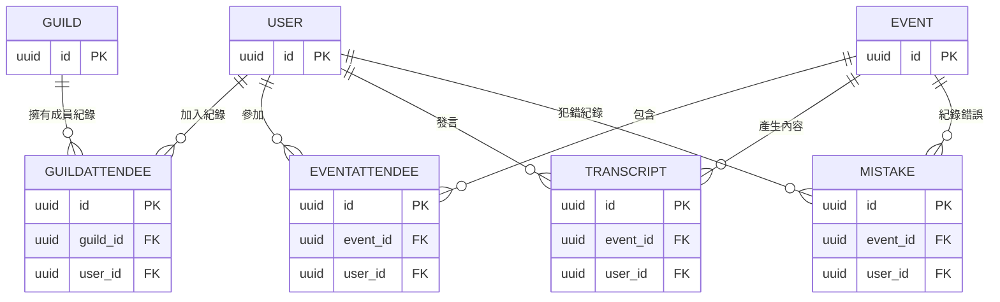


> [!Warning]
> 現在後端應該會看有沒有機會整合到supabase，到時候很可能各項設計都會整合過去。

# Database
## 關連圖

## Schema
> [!Important]
> 以下幾個常見Attribute的說明如下： 
> - `PK`: Primary Key。唯一用來代表這個表中的key
> - `FK`: Foreign Key。用來access其它表中的資料
> - `Nullable`:  這一項可以是空的

### User

| Field             | Type        | Attribute              | Note                                |
| ----------------- | ----------- | ---------------------- | ----------------------------------- |
| id                | UUID        | PK                     | 使用者的UID (JSON response: user_id)                             |
| email             | String      | Unique, Index          | 登入帳號，必須唯一                           |
| name              | String      |                        | 顯示名稱                                |
| avatar_url        | String      | Nullable               | 頭像連結                                |
| password_hash     | String      | Nullable               | Bcrypt/Argon2 雜湊值 第三方登入者此欄為 NULL |
| is_email_verified | Boolean     | Default: `false`       | 第三方登入預設為 true                       |
| role              | Enum/String | Default: `user`        | user, admin, staff                  |
| status            | Enum/String | Default: `active`      | active, banned, suspended           |
| timezone          | String      | Default: `Asia/Taipei` | 用於通知與時間顯示                           |
| created_at        | Timestamp   |                        | 帳號被建立時間                             |
| updated_at        | Timestamp   |                        | 帳號最後更新時間                            |
| deleted_at        | Timestamp   | Index, Nullable        | 帳號被刪除(soft delete)時間                |
| late_streak       | Int         | Default: `0`           | 連續遲到次數                              |
| points            | Int         | Default: `0`           | 該使用者總積分(跨公會)                        |
| level             | Int         | Default: `0`           | 使用者的等級                              |

### Event
| Field        | Type        | Attribute         | Note                                               |
| ------------ | ----------- | ----------------- | -------------------------------------------------- |
| id           | UUID        | PK                | 活動的UID (JSON response: event_id)                                             |
| title        | String      |                   | 活動之標題                                              |
| description  | Text        | Nullable          | 有關該活動之敘述                                           |
| start_time   | Timestamp   |                   | 活動開始時間                                             |
| exp_duration | Float       |                   | 預計活動時間長度                                           |
| act_duration | Float       | Nullable          | 實際活動時間長度                                           |
| record_link  | String      | Nullable          | 錄影連結                                               |
| mode         | Enum/String | Default: `report` | 活動模式 (report, conversation, discussion, review) |
| note         | Text        | Nullable          | 活動備註                                               |
| created_at   | Timestamp   |                   | 活動建立時間                                             |
| updated_at   | Timestamp   |                   | 活動最後更新時間                                           |
| deleted_at   | Timestamp   | Index, Nullable   | 活動被刪除(soft delete)時間                               |

#### EventAttendee
用來記錄活動和使用者多對多的關係，還有額外存兩兩間的資訊：

| Field       | Type        | Attribute                    | Note                         |
| ----------- | ----------- | ---------------------------- | ---------------------------- |
| id          | UUID        | PK                           | 對應關係的UID                     |
| event_id    | UUID        | FK, Unique Composite Index   | 活動的UID                       |
| user_id     | UUID        | FK, Unique Composite Index   | 使用者的UID                      |
| role        | Enum/String | Default: `member`            | 在這場活動中的角色 (member, emcee) |
| joined_at   | Timestamp   | Nullable                     | 加入活動的時間戳                     |
| leaved_at   | Timestamp   | Nullable                     | 離開活動的時間戳                     |

#### Transcript
| Field         | Type     | Attribute | Note      |
| ------------- | -------- | --------- | --------- |
| id            | UUID     | PK        | 逐字稿的UID (JSON response: transcript_id)   |
| event_id      | UUID     | FK        | 活動的UID    |
| user_id       | UUID     | FK        | 說話的使用者UID |
| transcript    | Text     |           | 逐字稿的內容    |
| accent        | Json     |           | 逐字稿的音調    |
| start_time    | Float    |           | 影片中開始秒數   |
| end_time      | Float    |           | 影片中結束秒數   |
| note          | Text     | Nullable  | 針對這個句字的註解 |
| created_at    | Timestamp |          | 逐字稿建立時間   |
| updated_at    | Timestamp |          | 逐字稿最後更新時間 |

#### Mistake
| Field       | Type        | Attribute          | Note                                           |
| ----------- | ----------- | ------------------ | ---------------------------------------------- |
| id          | UUID        | PK                 | 錯誤的UID (JSON response: mistake_id)                                         |
| event_id    | UUID        | FK                 | 活動的UID                                         |
| user_id     | UUID        | FK                 | 說話的使用者UID                                      |
| type        | Enum/String | Default: `grammar` | 錯誤的種類 (grammar, vocab, pronounce, advanced) |
| origin_text | Text        |                    | 原始文字內容                                         |
| fixed_text  | Text        |                    | AI修正後文本                                        |
| start_time  | Float       |                    | 影片中開始秒數                                        |
| end_time    | Float       |                    | 影片中結束秒數                                        |
| comment     | Text        | Nullable           | AI給出的評論                                        |
| note        | Text        | Nullable           | 針對這個句字的註解                                      |
| created_at  | Timestamp   |                    | 錯誤記錄建立時間                                       |
| updated_at  | Timestamp   |                    | 錯誤記錄最後更新時間                                     |

### Guild
| Field       | Type      | Attribute       | Note            |
| ----------- | --------- | --------------- | --------------- |
| id          | UUID      | PK              | 公會的UID (JSON response: guild_id)          |
| name        | String    |                 | 公會的名字           |
| description | Text      |                 | 公會的敘述，有關公會活動的敘述 |
| avatar_url  | String    | Nullable        | 公會的avatar連結     |
| level       | Int       | Default: `0`    | 公會的等級           |
| created_at  | Timestamp |                 | 公會建立時間          |
| updated_at  | Timestamp |                 | 公會最後更新時間        |
| deleted_at  | Timestamp | Index, Nullable | 公會被刪除(soft delete)時間 |

#### GuildAttendee
用來記錄公會和使用者多對多的關係，還有額外存他們兩兩間的資訊：

| Field     | Type        | Attribute                    | Note                         |
| --------- | ----------- | ---------------------------- | ---------------------------- |
| id        | UUID        | PK                           | 對應關係的UID                     |
| guild_id  | UUID        | FK, Unique Composite Index   | 公會的UID                       |
| user_id   | UUID        | FK, Unique Composite Index   | 使用者的UID                      |
| role      | Enum/String | Default: `member`            | 在這個公會的角色 (member, master) |
| joined_at | Timestamp   | Nullable                     | 加入公會的時間戳                     |
| leaved_at | Timestamp   | Nullable                     | 離開公會的時間戳                     |

## Developer Notes

1. **密碼處理**：
* 嚴禁儲存明碼。
* 請使用 `bcrypt` 或 `Argon2` 做hashing (主要是用在保護使用者的)
* 註冊 API 需實作「Email 唯一性檢查」。

2. **查詢效能優化 (Indexing)**：
* 請確保 `event_attendee` 表格針對 `(event_id, user_id)` 建立**唯一**複合索引 (Unique Composite Index)，以加速「查某人參加過哪些活動」的查詢，並防止重複加入。
* 請確保 `guild_attendee` 表格針對 `(guild_id, user_id)` 建立**唯一**複合索引 (Unique Composite Index)，防止同一使用者重複加入同一公會。

3. **時區處理**：
* 資料庫內所有時間 (`created_at`, `start_time`) 一律存 **UTC** 時間。
* 顯示給前端時，請依照 User 表格中的 `timezone` 欄位進行轉換。

4. **影片時間偏移型別討論 (待決議)**：

> [!Note]
> `Transcript` 和 `Mistake` 的 `start_time`/`end_time` 目前使用 `Float`（秒數）。
> 
> **潛在問題**：浮點數精度問題可能造成以下困擾：
> - 排序不穩定（`1.0000001` vs `1.0` 在 DB 層是不同值）
> - 區間查詢有誤差（overlap 計算可能出錯）
> - 跨語言序列化/反序列化時精度損失
> 
> **替代方案**：改用 `Int`（毫秒，e.g. `start_ms`, `end_ms`），精確且排序穩定。
> 
> **現狀**：維持 `Float`，待確認影片時間偏移的精度需求後再決定是否遷移。
