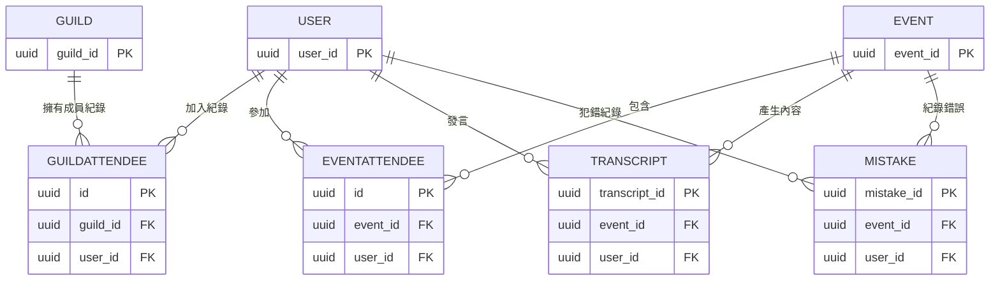

# Database schema

> [!Warning]
> 現在後端應該會看有沒有機會整合到supabase，到時候很可能各項設計都會整合過去。

# Database
## 關連圖

## Schema
> [!Important]
> 以下幾個常見Attribute的說明如下： 
> - `PK`: Primary Key。唯一用來代表這個表中的key
> - `FK`: Foreign Key。用來access其它表中的資料
> - `Nullable`:  這一項可以是空的

### User

| Field             | Type        | Attribute              | Note                                |
| ----------------- | ----------- | ---------------------- | ----------------------------------- |
| user_id           | String/UUID | PK                     | 使用者的UID                             |
| email             | String      | Unique, Index          | 登入帳號，必須唯一                           |
| name              | String      |                        | 顯示名稱                                |
| avatar_url        | String      | Nullable               | 頭像連結                                |
| password_hash     | String      | Nullable               | Bcrypt/Argon2 雜湊值 第三方登入者此欄為 NULL |
| is_email_verified | Boolean     | Default: `false`       | 第三方登入預設為 true                       |
| role              | Enum/String | Default: `user`        | user, admin, staff                  |
| status            | Enum/String | Default: `active`      | active, banned, suspended           |
| timezone          | String      | Default: `Asia/Taipei` | 用於通知與時間顯示                           |
| created_at        | Timestamp   |                        | 帳號被建立時間                             |
| deleted_at        | Timestamp   | Index, Nullable        | 帳號被刪除(soft delete)時間                |
| late_streak       | Int         | Default: `0`           | 連續遲到次數                              |
| points            | Int         | Default: `0`           | 該使用者總積分(跨公會)                        |
| level             | Int         | Default: `0`           | 使用者的等級                              |

### Event
| Field        | Type        | Attribute         | Note                                               |
| ------------ | ----------- | ----------------- | -------------------------------------------------- |
| event_id     | Int/UUID    | PK                | 活動的UID                                             |
| title        | String      |                   | 活動之標題                                              |
| description  | Text        | Nullable          | 有關該活動之敘述                                           |
| start_time   | Timestamp   |                   | 活動開始時間                                             |
| exp_duration | Float       |                   | 預計活動時間長度                                           |
| act_duration | Float       | Nullable          | 實際活動時間長度                                           |
| record_link  | String      | Nullable          | 錄影連結                                               |
| mode         | Enum/String | Default: `report` | 活動模式 (report, conversation, discussion, review) |
| note         | Text        | Nullable          | 針對活動的註解                                            |

#### EventAttendee
用來記錄活動和使用者多對多的關係，還有額外存兩兩間的資訊：

| Field       | Type        | Attribute         | Note                         |
| ----------- | ----------- | ----------------- | ---------------------------- |
| id          | Int/UUID    | PK                | 對應關係的UID                     |
| event_id    | Int/UUID    | FK, Index         | 活動的UID                       |
| user_id     | Int/UUID    | FK, Index         | 使用者的UID                      |
| role        | Enum/String | Default: `member` | 在這場活動中的角色 (member, emcee) |
| joined_at   | Timestamp   | Nullable          | 加入活動的時間戳                     |
| leaved_at   | Timestamp   | Nullable          | 離開活動的時間戳                     |

#### Transcript
| Field         | Type     | Attribute | Note      |
| ------------- | -------- | --------- | --------- |
| transcript_id | Int/UUID | PK        | 逐字稿的UID   |
| event_id      | Int/UUID | FK        | 活動的UID    |
| user_id       | Int/UUID | FK        | 說話的使用者UID |
| transcript    | Text     |           | 逐字稿的內容    |
| accent        | Json     |           | 逐字稿的音調    |
| start_time    | Float    |           | 影片中開始秒數   |
| end_time      | Float    |           | 影片中結束秒數   |
| note          | Text     | Nullable  | 針對這個句字的註解 |

#### Mistake
| Field       | Type        | Attribute          | Note                                           |
| ----------- | ----------- | ------------------ | ---------------------------------------------- |
| mistake_id  | UUID     | PK                 | 錯誤的UID                                         |
| event_id    | Int/UUID    | FK                 | 活動的UID                                         |
| user_id     | Int/UUID    | FK                 | 說話的使用者UID                                      |
| type        | Enum/String | Default: `grammar` | 錯誤的種類 (grammar, vocab, pronounce, advanced) |
| origin_text | Text        |                    | 原始文字內容                                         |
| fixed_text  | Text        |                    | AI修正後文本                                        |
| start_time  | Float       |                    | 影片中開始秒數                                        |
| end_time    | Float       |                    | 影片中結束秒數                                        |
| comment     | Text        | Nullable           | AI給出的評論                                        |
| note        | Text        | Nullable           | 針對這個句字的註解                                      |

### Guild
| Field       | Type     | Attribute    | Note            |
| ----------- | -------- | ------------ | --------------- |
| guild_id    | Int/UUID | PK           | 公會的UID          |
| name        | String   |              | 公會的名字           |
| description | Text     |              | 公會的敘述，有關公會活動的敘述 |
| avatar_url  | String   | Nullable     | 公會的avatar連結     |
| level       | Int      | Default: `0` | 公會的等級           |

#### GuildAttendee
用來記錄公會和使用者多對多的關係，還有額外存他們兩兩間的資訊：

| Field     | Type        | Attribute         | Note                         |
| --------- | ----------- | ----------------- | ---------------------------- |
| id        | Int/UUID    | PK                | 對應關係的UID                     |
| guild_id  | Int/UUID    | FK, Index         | 公會的UID                       |
| user_id   | Int/UUID    | FK, Index         | 使用者的UID                      |
| role      | Enum/String | Default: `member` | 在這個公會的角色 (member, master) |
| joined_at | Timestamp   | Nullable          | 加入公會的時間戳                     |
| leaved_at | Timestamp   | Nullable          | 離開公會的時間戳                     |

## Developer Notes

1. **密碼處理**：
* 嚴禁儲存明碼。
* 請使用 `bcrypt` 或 `Argon2` 做hashing (主要是用在保護使用者的)
* 註冊 API 需實作「Email 唯一性檢查」。

2. **查詢效能優化 (Indexing)**：
* 請確保 `event_attendee` 表格針對 `(event_id, user_id)` 建立複合索引 (Composite Index)，以加速「查某人參加過哪些活動」的查詢。

3. **時區處理**：
* 資料庫內所有時間 (`created_at`, `start_time`) 一律存 **UTC** 時間。
* 顯示給前端時，請依照 User 表格中的 `timezone` 欄位進行轉換。
