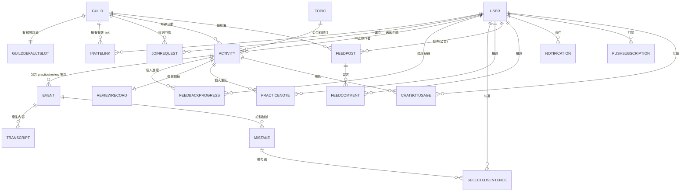

# Talkuma Schema 補齊 Plan

## 0. 全域約定

* **PK**:統一 `uuid.UUID`,GORM `id` 欄位
* **Soft delete**:有 `DeletedAt gorm.DeletedAt` 的表沿用既有 pattern
* **時間欄位**:UTC 存 DB,顯示由前端依 `User.timezone` 轉換
* **複合 unique index**:GORM tag 用 `uniqueIndex:idx_name`(避免 Fix 2 那個 plain `index` 的坑)
* **TEXT 欄位**:長文字一律加 `gorm:"type:text"`(避免 Fix 9 那個 varchar(255) 的坑)
* **FK constraint**:沿用 Session 4 已建立的 FK pattern
* **資料現況**:目前無 production 資料,可以直接 AutoMigrate 重建


---

## 1. 既有 Schema 的調整

### 1.1 EventMode enum

| 變動  | 詳細  |
|-----|-----|
| 移除  | `discussion`(階段 0 已確認 Won't Have) |
| 保留  | `report`、`conversation`、`review` |

```go
// internal/domain/event.go
type EventMode string

const (
    EventModeReport       EventMode = "report"
    EventModeConversation EventMode = "conversation"
    EventModeReview       EventMode = "review"
)
```

### 1.2 Event 表

新增欄位以連到 Activity 抽象層,並補齊練習場次的特定欄位。

| 欄位  | 型別  | 說明  |
|-----|-----|-----|
| `activity_id` | UUID, FK → Activity | **新增**。一個 Activity 對應 1 個 practice mode Event + 1 個 review mode Event |
| `recording_started_by` | UUID, FK → User, Nullable | **新增**。錄影啟動時的主持人(audit 用,只在 practice mode 寫入) |
| `recording_started_at` | Timestamp, Nullable | **新增**。錄影開始時間 |
| `recording_ended_at` | Timestamp, Nullable | **新增**。錄影結束時間 |

**新增 unique constraint**:`(activity_id, mode)` — 一個 Activity 對於同一個 mode 只能有一個 Event(避免重複建)。

> 📝 主持人變更不寫 DB,由 WebRTC Hub 內存管理。只記錄錄影起點當時的主持人。

### 1.3 Mistake 表

擴充欄位以支援 Page Spec 的「AI 信心度」、「Chatbot 迭代後的最新版本」、「視覺狀態」設計。

| 欄位  | 型別  | 說明  |
|-----|-----|-----|
| `confidence` | Enum/String, Default: `medium` | **新增**。AI 信心度:`low / medium / high`。低信心度在 P-22 顯示紅點 |
| `latest_correction_text` | Text, Nullable | **新增**。Chatbot 迭代後的最新修正版本。NULL 表示尚未經過 chatbot 迭代,前端 fallback 顯示 `fixed_text`(初版) |
| `latest_correction_source` | Enum/String, Default: `initial` | **新增**:`initial`(僅初版)、`chatbot`(經 chatbot 迭代) |
| `interacted_at` | Timestamp, Nullable | **新增**。使用者第一次點開查看的時間,影響 P-22 句子視覺狀態(未點開 / 已點開) |

> 📝 既有 `type`(grammar / vocab / pronounce / advanced)保留,確認為預期行為。 📝 既有 `note`(使用者個人註解)保留,雖 MVP Page Spec 未涵蓋此 feature,留著不會壞事。

### 1.4 User 表

`points` / `level` / `late_streak` 等欄位 MVP 階段不寫入(default 0),保留以利未來啟用點數機制。

**加** `**supabase_user_id**` **欄位**:User 表多一個 unique field,JWT.sub 直接 lookup。

| 欄位  | 型別  | 說明  |
|-----|-----|-----|
| `supabase_user_id` | String, Unique, Index | Supabase Auth 的 user UUID |

### 1.5 EventAttendee.role

不調整。但語意要對齊:Talkuma 設計中「主持人(emcee)」是動態的,進房後第一位自動成主持人並可轉移。

* `**role**` **欄位用法**:記錄使用者**參加**這場 Event 的角色快照,而非運行時主持人。MVP 階段所有 attendee 都先標 `member`,主持人改用 Hub 內存管理 + Event.recording_started_by 做錄影起點 audit。
* 未來若要做「主持人值日生輪流」這類 feature 再啟用 emcee 寫入。


---

## 2. 新增 Schema(MVP 必須)

### 2.1 Activity(配對單位)

Talkuma 的核心抽象:一次「練習 + 復盤」配對的 cycle,使用者 UI 上稱「第 N 次活動」。

| Field | Type | Attribute | Note |
|-------|------|-----------|------|
| id    | UUID | PK        | 活動 UID(JSON: `activity_id`) |
| guild_id | UUID | FK → Guild, Index | 所屬公會 |
| sequence_number | Int  |           | 第 N 次活動,公會內遞增 |
| status | Enum/String | Default: `pending_practice` | `pending_practice / in_practice / analyzing / in_feedback / in_review / done / aborted` |
| mode  | Enum/String |           | 該活動的練習模式(`report / conversation`),與其 practice Event 同步 |
| theme | Text | Nullable  | 公告組題目 / 報告主題;對話練習可空(由公告組 Topic FK 補) |
| announce_topic_id | UUID | FK → Topic, Nullable | 對話練習公告組題目(從題庫指定);報告練習此欄為空 |
| youtube_url | String | Nullable  | 練習錄影上傳 YouTube unlisted 後的網址 |
| ai_status | Enum/String | Default: `pending` | `pending / processing / completed / failed`;AI 初版分析狀態 |
| youtube_status | Enum/String | Default: `pending` | `pending / uploading / completed / failed`;YouTube 上傳狀態 |
| aborted_by_user_id | UUID | FK → User, Nullable | 中止操作者 |
| aborted_at | Timestamp | Nullable  | 中止時間 |
| aborted_reason | Text | Nullable  | 中止理由(使用者填寫,自由文字) |
| created_at | Timestamp |           |      |
| updated_at | Timestamp |           |      |
| deleted_at | Timestamp | Index, Nullable | Soft delete |

**Index**:

* `(guild_id, sequence_number)` 複合 unique
* `status` 單欄 index(Dashboard 與 cron 大量篩選用)
* `ai_status`、`youtube_status` 單欄 index(worker 掃描用)

**Developer Notes**:

* `sequence_number` 由 application 在 create 時透過 `MAX(sequence_number) + 1 WHERE guild_id = ?` 計算,放在 transaction 內。
* 一個 Activity 應該有兩筆 Event(mode=practice / review)一起建立,但實際 record 由排程 RPC 同 transaction 寫入。
* `ai_status` 與 `youtube_status` 為兩條獨立 pipeline,合計才推進 status `analyzing → in_feedback`(實作見 v0.4 §8.3)。

### 2.2 InviteLink

公會邀請連結。

| Field | Type | Attribute | Note |
|-------|------|-----------|------|
| id    | UUID | PK        |      |
| guild_id | UUID | FK → Guild, Index |      |
| token | String | Unique    | URL token,32 字元隨機字串 |
| expires_at | Timestamp |           | 建立後 7 天 |
| created_by_user_id | UUID | FK → User | 通常為 leader |
| created_at | Timestamp |           |      |

**Index**:`token` unique;`(guild_id, expires_at)`(查公會目前有效 link 用)

**Developer Notes**:

* 同公會同時只能有一個有效 link。產生新 link 時把舊的 `expires_at` 設為 `now()` 失效,不刪除(留 audit)。
* 不限使用次數,只看 `expires_at`。

### 2.3 GuildDefaultSlot

公會預設練習時段(可選)。

| Field | Type | Attribute | Note |
|-------|------|-----------|------|
| guild_id | UUID | PK, FK → Guild | 1:1 關係 |
| day_of_week | Int  |           | 0-6,0=Sunday |
| time_of_day | Time |           | HH:MM:SS |
| timezone | String | Default: `Asia/Taipei` | IANA timezone |
| created_at | Timestamp |           |      |
| updated_at | Timestamp |           |      |

**Developer Notes**:

* 公會可不設預設時段,完全手動排程。沒 row 即視為「未設定」。
* 排程 RPC 使用此 slot 自動推算下次活動時間時,需轉成 UTC 存 Activity 的 Event。

### 2.4 Topic(題庫)

| Field | Type | Attribute | Note |
|-------|------|-----------|------|
| id    | UUID | PK        |      |
| kind  | Enum/String |           | `announce`(公告組,公會長挑) / `random`(抽選組,系統抽) |
| title_jp | Text |           | 題目本文(日文) |
| difficulty | Enum/String | Default: `medium` | `easy / medium / hard` |
| hint_vocab | JSONB | Nullable  | 推薦詞彙陣列(F-5.4),格式 `[{"word": "...", "reading": "...", "meaning": "...", "level": "easy"}]` |
| hint_grammar | JSONB | Nullable  | 推薦文法句型陣列,格式同上 |
| created_at | Timestamp |           |      |
| updated_at | Timestamp |           |      |
| deleted_at | Timestamp | Index, Nullable |      |

**Developer Notes**:

* MVP 階段內容由平台後台維運手動建立。沒有題目 CRUD API。
* `kind=random` 的抽題:由 backend RPC `pick_random_topic()` 隨機 SELECT 一筆。MVP 不做難度篩選。

### 2.5 ReportThemeSuggestion(報告主題建議)

| Field | Type | Attribute | Note |
|-------|------|-----------|------|
| id    | UUID | PK        |      |
| title | String |           | 主題標題 |
| description | Text | Nullable  | 說明   |
| created_at | Timestamp |           |      |

**Developer Notes**:

* 純參考清單,公會長排報告練習時可參考。MVP 階段平台後台維運。

### 2.6 FeedbackProgress

每位成員對每個 Activity 的回饋進度。

| Field | Type | Attribute | Note |
|-------|------|-----------|------|
| activity_id | UUID | FK → Activity, Composite PK |      |
| user_id | UUID | FK → User, Composite PK |      |
| status | Enum/String | Default: `not_started` | `not_started / in_progress / completed` |
| started_at | Timestamp | Nullable  | 第一次進入 P-22 時寫入 |
| completed_at | Timestamp | Nullable  | 按下完成回饋按鈕時寫入 |
| updated_at | Timestamp |           |      |

**Index**:`(activity_id, status)`(降級 cron 篩選未完成成員用)

**Developer Notes**:

* Composite PK `(activity_id, user_id)`,確保一個成員一個活動只一筆。
* 「leader 可看所有人進度但看不到內容」靠**權限分離 + 表分離**達成:此表只有進度(safe),修正內容在 Mistake 表(權限獨立)。

### 2.7 SelectedSentence(復盤選題)

每位成員從自己的 Mistake 中勾選最多 2 題帶到復盤。

| Field | Type | Attribute | Note |
|-------|------|-----------|------|
| id    | UUID | PK        |      |
| activity_id | UUID | FK → Activity, Index | 冗餘欄位,加速復盤清單查詢 |
| mistake_id | UUID | FK → Mistake, Unique Composite Index | 同一 mistake 不能被重複勾選 |
| selected_by_user_id | UUID | FK → User, Composite Index | 勾選人(必為該 mistake 的 speaker,或降級時為系統代選) |
| is_degraded | Bool | Default: `false` | true = 降級機制系統自動選 |
| created_at | Timestamp |           |      |

**Index**:

* `(mistake_id, selected_by_user_id)` 複合 unique(防止重複勾選)
* `(selected_by_user_id, activity_id)` 複合 index(查使用者本場已選幾題用,需 ≤ 2)
* `(activity_id, mistake_id)` 複合 index(復盤清單 join 用)

**Developer Notes**:

* 上限檢查:`SELECT COUNT WHERE selected_by_user_id = ? AND activity_id = ?` 必 < 2 才允許 INSERT。
* 降級機制由 cron 寫入,`is_degraded=true`、`selected_by_user_id` 仍記原該成員 ID。
* 復盤清單按 `mistake.start_offset_sec` 排序(時間序排列,UF-D15)。

### 2.8 ReviewRecord(復盤第二階段歸納)

| Field | Type | Attribute | Note |
|-------|------|-----------|------|
| activity_id | UUID | PK, FK → Activity | 1:1  |
| stage2_summary | JSONB | Nullable  | Chatbot 歸納內容,結構: `{"patterns": [...], "knowledge_points": [...], "practice_scenarios": [...]}` |
| created_at | Timestamp |           |      |
| updated_at | Timestamp |           |      |

**Developer Notes**:

* 第二階段觸發時(主持人按進入第二階段)由 chatbot worker 寫入 / 更新。
* MVP 不持久化 stage1 的 chatbot 對話歷史(S7-D5),只存第二階段最終歸納結果。

### 2.9 Notification(站內通知)

| Field | Type | Attribute | Note |
|-------|------|-----------|------|
| id    | UUID | PK        |      |
| user_id | UUID | FK → User, Composite Index | 收件者  |
| kind  | String |           | 事件類型,如 `activity.scheduled` / `analysis.completed`(列表見 v0.4 §6) |
| payload | JSONB |           | 通知內容 + deeplink + 顯示文案 |
| read_at | Timestamp | Nullable  | 已讀時間 |
| created_at | Timestamp | Index     |      |

**Index**:

* `(user_id, read_at, created_at DESC)` 複合 index(鈴鐺面板查詢用,filter 已讀 + 時間排序)
* `(user_id) WHERE read_at IS NULL` 部分 index(未讀數查詢加速)— 可選

**Developer Notes**:

* 通知派送 worker(goroutine)寫入此表後,透過 WebSocket Hub broadcast 到該 user 的 connection,前端鈴鐺即時更新。

### 2.10 FeedPost(動態牆貼文)

| Field | Type | Attribute | Note |
|-------|------|-----------|------|
| id    | UUID | PK        |      |
| guild_id | UUID | FK → Guild, Composite Index |      |
| type  | Enum/String |           | `system`(系統通知)/ `announcement`(公會長公告) |
| author_user_id | UUID | FK → User, Nullable | 系統貼文為 NULL,公告為公會長 |
| content | Text |           | 主文   |
| metadata | JSONB | Nullable  | 系統貼文的事件 metadata(與 Notification.payload 類似) |
| created_at | Timestamp | Index     |      |
| deleted_at | Timestamp | Index, Nullable |      |

**Index**:`(guild_id, created_at DESC)` 複合 index(列表查詢用)

**Developer Notes**:

* MVP 不做使用者一般 post(階段 3 D1)。
* 發系統通知的事件同時也產生對應 FeedPost(若該事件依 Design Spec 3.2 應出現在動態牆)。

### 2.11 FeedComment(留言)

| Field | Type | Attribute | Note |
|-------|------|-----------|------|
| id    | UUID | PK        |      |
| post_id | UUID | FK → FeedPost, Composite Index |      |
| author_user_id | UUID | FK → User |      |
| content | Text |           |      |
| created_at | Timestamp | Index     |      |
| deleted_at | Timestamp | Index, Nullable |      |

**Index**:`(post_id, created_at)` 複合 index

### 2.12 PracticeNote(報告練習個人筆記)

| Field | Type | Attribute | Note |
|-------|------|-----------|------|
| activity_id | UUID | FK → Activity, Composite PK |      |
| user_id | UUID | FK → User, Composite PK |      |
| content | Text |           |      |
| updated_at | Timestamp |           |      |

**Developer Notes**:

* 報告練習中非報告者的個人筆記(F-4.11)。對話練習用共享白板,不寫此表。
* Composite PK,確保一個成員一個活動只一筆。
* 使用 UPSERT 保存(前端 debounced)。

### 2.13 ChatbotUsage(計費紀錄,未來 freemium 用)

| Field | Type | Attribute | Note |
|-------|------|-----------|------|
| id    | UUID | PK        |      |
| user_id | UUID | FK → User, Index |      |
| activity_id | UUID | FK → Activity, Nullable, Index |      |
| kind  | Enum/String |           | `feedback`(P-22)/ `review_stage1`(P-23 查證)/ `review_stage2`(P-23 歸納)/ `historical`(P-13 繼續對話) |
| message_count | Int  |           | 使用者送出訊息數 |
| tokens_in | Int  |           | LLM input tokens |
| tokens_out | Int  |           | LLM output tokens |
| created_at | Timestamp | Index     |      |

**Developer Notes**:

* 每個 chatbot session 結束時(無論 finalize 或 timeout)寫一筆。MVP 不向使用者顯示,只做後續 freemium 切入點的數據基礎。


---

## 3. 新增 Schema(MVP Should)

### 3.1 JoinRequest(公會板加入申請)

| Field | Type | Attribute | Note |
|-------|------|-----------|------|
| id    | UUID | PK        |      |
| guild_id | UUID | FK → Guild, Composite Index |      |
| user_id | UUID | FK → User, Composite Index |      |
| status | Enum/String | Default: `pending` | `pending / approved / rejected / cancelled` |
| created_at | Timestamp |           |      |
| updated_at | Timestamp |           |      |

**Index**:`(user_id, status)` 部分 index(查 pending 申請用)

**Developer Notes**:

* 使用者加入任一公會後,所有 pending 申請自動 cancel(UF-D25)。
* 此邏輯包在 RPC `accept_invite` 與 `approve_application` 內。

### 3.2 PushSubscription

| Field | Type | Attribute | Note |
|-------|------|-----------|------|
| id    | UUID | PK        |      |
| user_id | UUID | FK → User, Index |      |
| endpoint | String | Unique    | Browser Push subscription endpoint |
| keys  | JSONB |           | Subscription keys(p256dh, auth) |
| created_at | Timestamp |           |      |


---

## 4. 權限驗證 Helper Function 簽名

實作於 `internal/api/auth.go` 或新建 `internal/api/permissions.go`。每個 helper 接收 `*gin.Context` + 必要參數,驗證失敗直接 `c.JSON(403, ...)` 並 return 錯誤,handler 直接判斷 error 早退。

```go
// 已有(JWT 驗證)
func (a *API) AuthMiddleware() gin.HandlerFunc

// 新增 — 權限驗證 helper
func (a *API) RequireGuildMember(c *gin.Context, guildID uuid.UUID) error
func (a *API) RequireGuildLeader(c *gin.Context, guildID uuid.UUID) error
func (a *API) RequireActivityMember(c *gin.Context, activityID uuid.UUID) error
func (a *API) RequireSelfOrGuildLeader(c *gin.Context, targetUserID uuid.UUID, guildID uuid.UUID) error
func (a *API) RequireMistakeOwner(c *gin.Context, mistakeID uuid.UUID) error  // 用於 chatbot 啟動等
func (a *API) RequireActivityVisible(c *gin.Context, activityID uuid.UUID) error  // 公會成員可見
```

**實作策略**:MVP 階段每個 helper 都先寫成「呼叫 repository 查 + 比對 caller」的直接版本。後端組可以後續 refine 加 cache(例如 caller 的公會 membership 一個 request 內 memoize)。

**呼叫範例**(handler 內):

```go
func (a *API) ActivityGetHandler(c *gin.Context) {
    activityID := uuid.MustParse(c.Param("id"))
    if err := a.RequireActivityVisible(c, activityID); err != nil {
        return // helper 已寫 response
    }
    // ...實際業務邏輯
}
```


---

## 5. AutoMigrate 順序

GORM AutoMigrate 順序需配合 FK 依賴。依序加入 `internal/cmd/api.go` 的 `db.AutoMigrate(...)`:

```go
db.AutoMigrate(
    // 既有
    &domain.User{},
    &domain.Guild{},
    &domain.GuildAttendee{},
    
    // 新增 — 公會層級配套
    &domain.GuildDefaultSlot{},
    &domain.InviteLink{},
    &domain.JoinRequest{},
    
    // 新增 — 題庫
    &domain.Topic{},
    &domain.ReportThemeSuggestion{},
    
    // 新增 — Activity(會被 Event 引用)
    &domain.Activity{},
    
    // 既有 — Event 與其關聯(順序需在 Activity 之後)
    &domain.Event{},  // 加 activity_id FK
    &domain.EventAttendee{},
    &domain.Transcript{},
    &domain.Mistake{},  // 加新欄位
    
    // 新增 — 回饋與復盤
    &domain.FeedbackProgress{},
    &domain.SelectedSentence{},
    &domain.ReviewRecord{},
    &domain.PracticeNote{},
    
    // 新增 — 動態牆
    &domain.FeedPost{},
    &domain.FeedComment{},
    
    // 新增 — 通知
    &domain.Notification{},
    &domain.PushSubscription{},
    
    // 新增 — 計費
    &domain.ChatbotUsage{},
)
```


---

## 6. ERD(增量)

Talkuma 新增表與既有表的關聯。為節省空間,既有的 `User / Guild / GuildAttendee` 等表只列出與新表的關聯。




---

## 7. Developer Notes 補充

### 7.1 Mistake 的 source_of_truth 規則

每個 Mistake 顯示給使用者時,優先順序:


1. `latest_correction_text` 不為 NULL → 顯示這個版本(使用者看過 chatbot 迭代後)
2. 否則顯示 `fixed_text`(初版)

### 7.2 Activity status 推進規則

```
pending_practice
  → in_practice           (第一個成員加入練習房間;由 WebRTC Hub 內 call repository 推進)
  → analyzing             (主持人按結束練習;同一個 transaction 寫入 Event.recording_ended_at)
  → in_feedback           (ai_status 與 youtube_status **二選一** 完成即推進。AI 是必要素材,YouTube 慢來不影響)
  → in_review             (復盤會開始時間到,由 cron 推進並觸發降級)
  → done                  (主持人按結束復盤,RPC 處理)

  → aborted               (任何非終態 → leader 手動或系統超時自動)
```

> ⚠️ 需要釐清:`analyzing → in_feedback` 由 AI 完成觸發,還是兩個都完成才觸發? 我傾向 **AI 完成即推進**(YouTube 慢來不影響使用者進入回饋),但 youtube_status 仍要追蹤。 此設計在 v0.4 §8 實作。

### 7.3 Time offset 型別

`Mistake.start_offset_sec / end_offset_sec` 與 `Transcript.start_offset_sec / end_offset_sec` 既有設計使用 Float(秒)。`database-design.md` 第 4 點 Developer Notes 已記錄這個 TODO(精度問題)。MVP 暫不動,但新表設計時間 offset 一律用 ms(int)避免再走老路:

* 若有新表需要 video time offset,使用 `int` 毫秒。
* 既有 Float 欄位待錄影合成 + 逐字稿 alignment 完成後評估遷移。

## 8. 給後端組的實作建議


1. **先建 Activity 與調整 Event 為配對結構**,因為這個是大根。其他新表都掛在這上面。
2. **權限 helper 第一波就要建好**:即使內部實作粗糙,簽名定下來,handler 可以開始用。後續 refine 不影響 handler 程式碼。
3. **AutoMigrate 重來無痛**:沒有 production 資料,migration 失敗就改 model 重來,不用寫 down migration。
4. **既有** `**Mistake.note**` **/** `**Transcript.note**` **保留**:雖 MVP Page Spec 沒用,但拿掉沒好處,留著不會壞事。
5. **計費表 ChatbotUsage 從 day 1 就寫**:即使 MVP 不向使用者展示,沒寫資料未來想啟用 freemium 就得從零開始。
